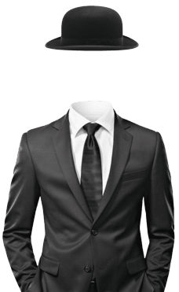

# Invisibility-Cloak-OpenCV


<div align="center">
 
</div>

This project demonstrates the creation of an invisibility cloak effect using OpenCV and Python. By utilizing HSV color space, masking techniques, and real-time video processing, it replaces a specific color in the video frame with the background, creating a magical "invisible" effect.

---

## Features

- Dynamic adjustment of HSV range using trackbars.
- Real-time video processing with a webcam.
- Noise reduction using median blur and dilation techniques.
- Frame merging to achieve a seamless invisibility effect.

---

## Requirements

- Python 3.x
- OpenCV (`cv2`)
- NumPy (`numpy`)

---

## Installation

1. Clone this repository:
   ```bash
   git clone https://github.com/yourusername/Invisibility-Cloak-OpenCV.git
   ```
2. Navigate to the project directory:
   ```bash
   cd Invisibility-Cloak-OpenCV
   ```
3. Install the required dependencies:
   ```bash
   pip install opencv-python numpy
   ```

---

## Usage

1. Run the script:
   ```bash
   python invisibility_cloak.py
   ```
2. Use the sliders to adjust the HSV range for the cloak's color.
3. Press **`q`** to quit the application.

---

## How It Works

1. **HSV Color Space**:
   - Converts frames from BGR to HSV for easier color detection.
2. **Masking**:
   - Creates a mask for the selected color range using the trackbars.
3. **Background Frame**:
   - Captures the background frame at the start of the script.
4. **Frame Mixing**:
   - Combines the mask and background to replace the cloak color with the background.

---


## Contribution

Feel free to fork this repository and submit pull requests for improvements or new features.

---

## License

This project is licensed under the [MIT License](LICENSE).

---

## Author

**Dipanjan Pathak**\
[Portfolio](https://www.dipanjan.tech/)
[Linked In](https://www.linkedin.com/in/dipanjanpathak/)


